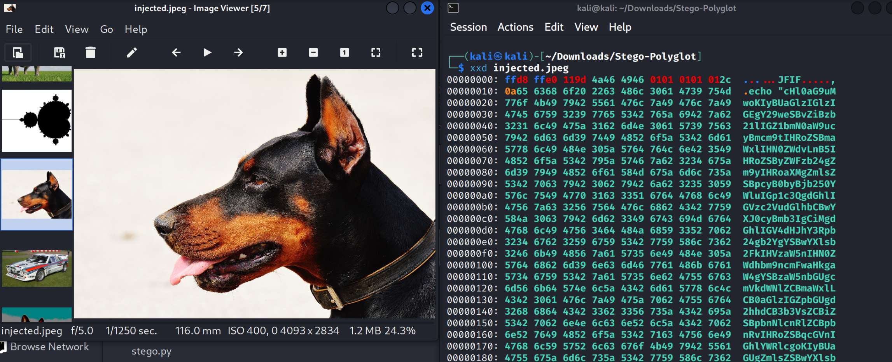

# Stego-Polyglot
## Author: Lukas Fernández Sierra

Inspired by: [https://github.com/mindcrypt/powerglot](https://github.com/mindcrypt/powerglot)

This repository contains various scripts that can be used to hide information within image files using steganography techniques such as LSB or other patterns that rely on pixel bits to store data.

Additionally, it includes scripts to create JPEG polyglots, which allow JPEG files to behave differently depending on the program used to open them.

An example is provided in the samples directory, which, when executed, establishes a reverse shell using Metasploit.

